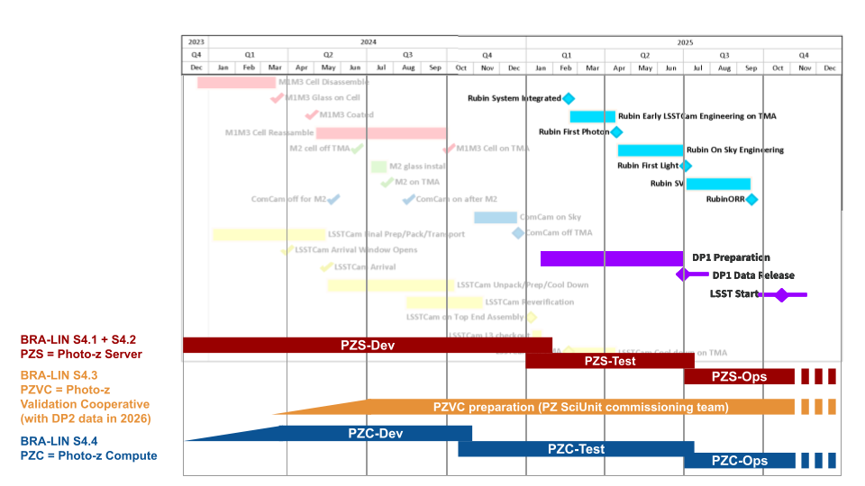

# BRA-LIN-S4     

In-kind contribution program BRA-LIN-S4 - Photometric Redshifts.

#### Introduction

This page describes the in-kind contributions offered by the Laboratório Interinstitucional de e-Astronomia ([LIneA](http://www.linea.org.br){:target="_blank"}) to [Vera C. Rubin Observatory](https://rubinobservatory.org/){:target="_blank"}, approved as part of the in-kind contribution program BRA-LIN. This is a live document that started with the description of planned work. It is regularly updated to offer a high-level description of the software produced as the program evolves. Technical documentation of each piece of software should be delivered together with the code in the respective repositories. For comments or suggestions, please open an issue [here](https://github.com/linea-it/pz-lsst-inkind-doc/issues){:target="_blank"}. 

*** 

Section 4 of the BRA-LIN proposal refers to the contributions related to Photometric Redshifts. It is organized into four subsections (click for more details):

* S4.1 - [PZ Training Set Maker](s4_1.md)
* S4.2 - [PZ Server](s4_2.md) 
* S4.3 - [PZ Validation Cooperative](s4_3.md)
* S4.4 - [PZ Tables as Federated Datasets](s4_4.md) 

#### Related documents

* [BRA-LIN in-kind contribution proposal](https://docs.google.com/document/d/1JWUG2vxxPD1DwrbQsZwI1q_2lk2TIGnHGHNbaq2zAbk/preview){:target="_blank"}

* [BRA-LIN S4 work plan approved by Rubin staff](https://drive.google.com/file/d/1SmMggDtbVOVogOboq6X-smjv6wbXus-3/preview){:target="_blank"}

* [BRA-LIN S4 annual evaluation report FY2023](https://drive.google.com/file/d/109e2cG9QnI-xaRFkzLAc6v9wdfwCkFjN/preview){:target="_blank"}

* BRA-LIN S4 annual evaluation report FY2024 (soon)

#### Project Management on GitHub

* [S4.1 and S4.2 - Training Set Maker and PZ](https://github.com/orgs/linea-it/projects/2/views/1){:target="_blank"}

* S4.3 - PZ Validation Cooperative (start in 2026 with DP2) 

* [S4.4 - PZ Compute](https://github.com/orgs/linea-it/projects/10/views/1){:target="_blank"}

#### Timeline 

BRA-LIN S4 Timeline revised on April 2025. 

#### LIneA Key Personnel

- **Proposal lead:** Luiz Nicolaci da Costa
- **Program manager:** Julia Gschwend
- **Contribution lead of BRA-LIN-S4:** [Julia Gschwend](mailto:julia@linea.org.br)
- **Front-end developers:** Glauber Costa Vila-Verde, Jandson Vitorino 
- **Back-end developers:** Cristiano Singulani, Henrique Dante, Heloisa Mengisztki
- **System analyst:** Carlos Adean
- **Science team:** Julia Gschwend, Luigi Silva, Andreia Dourado 

#### Rubin Observatory Key Personnel

- Primary recipient group: Rubin Photo-z Coordination Group (Contact point: Melissa Graham) 
- In-kind Program Coordinators (IPCs) for Software Development and Science Collaboration interactions in the Rubin Operations Director’s Office: Agnès Ferté, Aprajita Verma, Greg Madejski

Last updated: June 26, 2025
