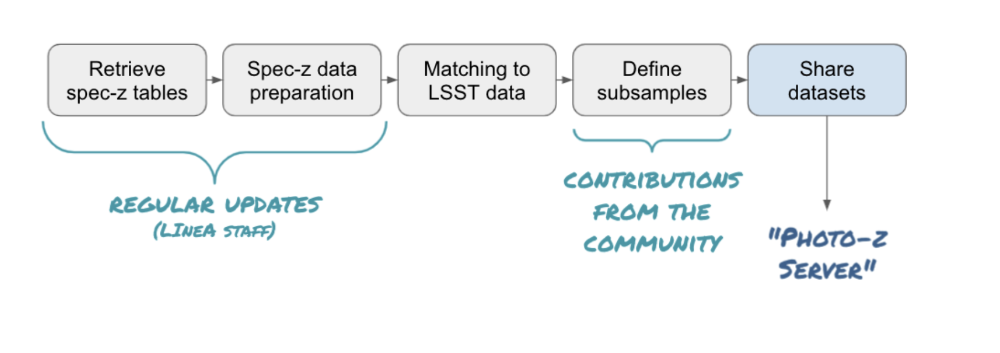

# BRA-LIN S4     

In-kind contribution program BRA-LIN S4 - Photometric Redshifts.

This page describes the in-kind contributions offered by the Laboratório Interinstitucional de e-Astronomia ([LIneA](http://www.linea.gov.br)) to [Vera C. Rubin Observatory](https://www.lsst.org/)'s PZ Coordination Group, approved as part of the in-kind contribution program BRA-LIN. The BRA-LIN in-kind contribution proposal document is available on [this link](https://docs.google.com/document/d/1JWUG2vxxPD1DwrbQsZwI1q_2lk2TIGnHGHNbaq2zAbk/edit?usp=sharing)

Section 4 of the proposal refers to the contributions related to Photometric Redshifts. It is organized in four subsections, summarized below:  

## BRA-LIN S4.1 - PZ TSM 

The Python package pz_tsm (Training Set Maker for Photo-zs) is inspired by its namesake Training Set Maker pipeline, available on the DES Science Portal ([Gschwend et al., 2018](https://www.sciencedirect.com/science/article/abs/pii/S2213133718300891?via%3Dihub)), but will rely on completely different infrastructure. The new Training Set Maker will take advantage of the administrative functions of the PZ Server to retrieve data and metadata and the Brazilian IDAC infrastructure to perform combinations of different datasets and cross-match with the LSST objects catalog. 

The package is designed to handle lightweight catalogs of spectroscopic redshifts (spec-z) to be used to train and validate PZ algorithms. It will offer useful Python functions to manipulate and visualize these catalogs expected to contain hundreds of thousand objects. It is by no means to be considered a tool to manipulate big data. 

The figure below shows the data flow through a series of steps. In the very beginning, it will use available tools such as Astroquery ([Ginsburg, Sipőcz, Brasseur, et al. 2019](https://ui.adsabs.harvard.edu/abs/2019AJ....157...98G/abstract)) to retrieve public spec-z catalogs available online. It would also allow the communication with the PZ Server to provide other spec-z catalogs which are not available online, such as proprietary data uploaded by users or simulated data built inside LSST for specific purposes. 

The package will provide a function to connect to PZ Server and perform the cross-matching of the objects with the objects in the LSST objects catalog and return the photometric data of interest for the construction of training and validation sets (e.g., magnitudes and respective errors).

The further manipulation of the matched data to define the training and validation subsamples might depend strongly on the specific science case. Therefore it is expected to receive contributions from the community for the implementation of science-driven methods of subsample definition (e.g., with weights or data augmentation). The core package will provide a simple random split of the matched sample into training and validation subsamples as default. 

Finally, the resulting training and validation sets created will be formatted according to the LSST requirements described in the [DMTN-049 - A Roadmap to Photometric Redshifts for the LSST Object Catalog](https://dmtn-049.lsst.io/) (to be defined by LSST Data Management (DM) System Science Team) and contain all the provenance information necessary to be ready to be uploaded on the PZ Server.

## BRA-LIN S4.2 - PZ Server 

 Inspired by features of the DES Science Portal ([Gschwend et al., 2018](https://www.sciencedirect.com/science/article/abs/pii/S2213133718300891?via%3Dihub); [Fausti Neto et al., 2018](https://www.sciencedirect.com/science/article/abs/pii/S2213133717300975)), the PZ Server is being planned to be an online service, complementary to the Rubin Science Platform (RSP), to host PZ-related lightweight data products and to offer data management tools that allow sharing data products among RSP users, attach and share relevant metadata, and help on provenance tracking. 
 
The PZ Server will be hosted in the Brazilian Independent Data Access Center (IDAC), being accessible via an independent URL (www.linea.gov.br/pz-server), open to all RSP users (LSST data rights holders), without geographic constraints. It is planned to be as broad and generic as possible to be useful to all LSST Science Collaborations working with PZ data products. As required by LSST in-kind program, the source code will be publicly available on GitHub (https://github.com/linea-it/pz-server).

The PZ Coordination Group will receive "admin" user credentials with special permissions. It will also be able to request uploads of official data products on-demand to the LIneA team.
The PZ Server is being designed with a special focus on helping RSP users participating in the PZ Validation Cooperative, a DM team's initiative that will take place during LSST commissioning phase (see technical note dmtn-049 for details), but it is planned to continue serving the LSST Community during subsequent years. During the PZ Validation Cooperative, the PZ Coordination Group will be able to use the PZ Server to host and distribute standardized training and validation sets to be used in algorithm performance comparison experiments and to collect the results obtained by different users. 

Beyond the PZ Validation Cooperative, the RSP users can use the PZ Server to easily keep track and share lightweight files containing varied test results. However, all data products uploaded to the PZ Server will automatically be visible and available, without any scientific validation, to all RSP users and only for this particular group. Therefore it is not the appropriate tool to release data products to the general public.   

## BRA-LIN S4.3 - PZ Validation Cooperative

The third contribution refers to offering help on the PZ Validation Cooperative by LIneA staff with expertise in photo-zs. This contribution is offered in terms of FTEs to execute tasks defined by the recipient group at the epoch of the Cooperative (commissioning phase). 

To know more about the PZ Validation Cooperative organized by LSST DM, please access the document [DMTN-049 - A Roadmap to Photometric Redshifts for the LSST Object Catalog](https://dmtn-049.lsst.io/). 

## BRA-LIN S4.4 - PZ Tables as Federated Datasets 

During its ten years of operations, the Legacy Survey of Space and Time (LSST) will provide photometric measurements for billions of objects. Most of the foreseen LSST science cases will rely on photometric redshifts (photo-z) estimates for these objects. 

The LSST project plan to provide at least one, possibly more, photo-z estimates for each object as part of each data release. Given the large and diverse scope of science that can result from the LSST data, a unique photo-z method is expected to not satisfy all the requirements of the whole community. 

As part of the BRA-LIN in-kind contribution program, this contribution consists in offering photo-z tables as federated datasets for each data release, using a different photo-z method from the official estimates (to be defined by the DM team), thus expanding the scope of the science supported by the data releases. 

The infrastructure required to produce, store, and deliver the photo-z tables will be provided by the Brazilian IDAC. The software development necessary to produce these tables, which include the optimization and refactoring of the DES photo-z pipelines to run on the LSST scale and the production of new pipelines to cover all steps of the data flow, is accounted for as a directable software development effort. 
