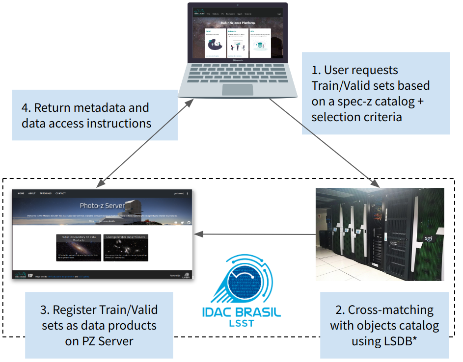

## S4.1 - PZ Training Set Maker 

#### Introduction

The Training Set Maker (TSM) is a cross-matching service tailored to create training sets to feed machine-learning-based photo-z algorithms at the catalog level. Although initially conceived as a separate service, during early development, the TSM was incorporated as a microservice under the [PZ Server](https://linea-it.github.io/pz-lsst-inkind-doc/s4_2/)'s umbrella. 

TSM was inspired by its namesake Training Set Maker pipeline, available on the DES Science Portal ([Gschwend et al., 2018](https://www.sciencedirect.com/science/article/abs/pii/S2213133718300891?via%3Dihub)), but, to scale for LSST datasets, it will rely on completely different infrastructure. 

The service will be delivered as a Python library with useful functions to: 
    
1. access, manipulate, and visualize lightweight catalogs of spectroscopic redshifts (spec-z) or true redshifts in case of simulated data locally at the user's environment (e.g., RSP notebook aspect, users' laptop, etc.). TSM will take advantage of the PZ Server's API [`pz-server-lib`](https://github.com/linea-it/pz-server-lib) (see API's documentation [here](https://linea-it.github.io/pz-server-lib/html/index.html)) to access user-generated catalogs hosted by the server.
     
2. perform combinations of different datasets and cross-matching with the LSST objects catalog via an asynchronous online service using the Brazilian IDAC's computing resources.

In both cases, RSP credentials are required for authentication and authorization purposes. 
 
TSM is not to be considered as an efficient tool for manipulating big data in the user's work environment. Nonetheless, it will take advantage of the administrative functions of the PZ Server to retrieve data and metadata and use the Brazilian IDAC's infrastructure to deal with large datasets.  

#### Overview of planned remote service 

* The technology used to perform the cross-matching will be determined in agreement with the collaboration, following along the results of [LINCC Frameworks](https://www.lsstcorporation.org/lincc/frameworks)' task force on this subject. Current efforts point to the adoption of catalog files using a partitioning schema based on [HIPSCat](https://github.com/astronomy-commons/hipscat) and the matching done in massive parallel processes orchestrated by [LSDB](https://github.com/astronomy-commons/lsdb), both under development. 
     

#### Forecasted use cases

1. The user retrieves specific spec-z catalogs from the PZ Server or other online services such as [Astroquery](https://astroquery.readthedocs.io/en/latest/) ([Ginsburg, Sipőcz, Brasseur, et al. 2019](https://ui.adsabs.harvard.edu/abs/2019AJ....157...98G/abstract)). The PZ Server will provide a list of previous public spec-z catalogs of interest (previously informed by the community), for which metadata and quality flags conversion will already be available.  

2. The user combines different spec-z catalogs into a single table. TSM will provide a mechanism to perform spatial cross-matching among multiple tables to resolve multiple spec-z measurements for the same galaxies (flexible criteria) and to standardize quality flags from different surveys in order to create spec-z compilations with redshifts from different sources. 

3. The user retrieves spec-z compilations from the PZ Server. The PZ Server will host a standardized compilation of spec-z with public data available up to date on each LSST Data Release, vetted by LSST DM staff. These compilations must be easy to find (e.g., flagged as "latest"), and contain detailed documentation for proper citation of the original sources.  

4. The user combines a spec-z table with photometric data from the LSST Objects Catalog to build a training set for photo-z codes. TSM will provide a mechanism to submit jobs to LIneA's HPC cluster to perform spatial cross-matching between a spec-z table registered on PZ Server and the copy of the LSST Object Catalog hosted in the Brazilian IDAC. The matching results will be registered on PZ Server as a new data product. Metadata and data access instructions will be sent back to the user.

5. The user splits the matched spec-photo catalog into two or more subsamples (for training and validation/test purposes). TSM will provide a simple method to split the data randomly into a finite number of parts, with proportions defined by the user. Additional methods that follow specific science-driven criteria to define subsamples or apply some transformation of the data (e.g., weighting or data augmentation) are not part of the scope of the in-kind contribution but can be added to the library later on. Contributions from the community are very welcome. 

6. The LSST PZ Commissioning Team uses the TSM to create standardized training and validation sets for the _Photo-z Validation Cooperative_ and uses the PZ Server to distribute them to the community. The resulting catalogs will be formatted according to the LSST requirements described in the [DMTN-049 - A Roadmap to Photometric Redshifts for the LSST Object Catalog](https://dmtn-049.lsst.io/) (to be defined by LSST Data Management (DM) System Science Team) and contain all the provenance information necessary to be reproduced using the same TSM tools by any user. 

