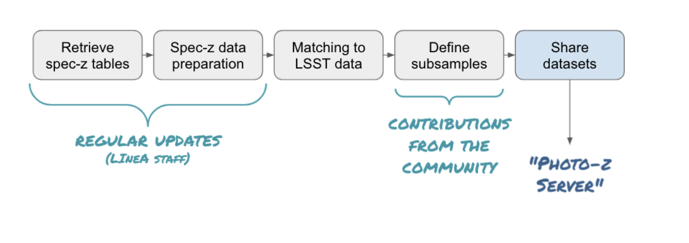

## S4.1 - PZ Training Set Maker 

The Python package pz_tsm (Training Set Maker for Photo-zs) is inspired by its namesake Training Set Maker pipeline, available on the DES Science Portal ([Gschwend et al., 2018](https://www.sciencedirect.com/science/article/abs/pii/S2213133718300891?via%3Dihub)), but will rely on completely different infrastructure. The new Training Set Maker will take advantage of the administrative functions of the PZ Server to retrieve data and metadata, and the Brazilian IDAC infrastructure, to perform combinations of different datasets and crossmatch with the LSST objects catalog. 

The package is designed to handle lightweight catalogs of spectroscopic redshifts (spec-z) to be used for the purpose of training and validation of PZ algorithms. It will offer useful Python functions to manipulate and visualize these catalogs that are expected to contain the order of hundreds of thousands of objects. It is by no means to be considered a tool to manipulate big data. 

The figure below shows the data flow through a series of steps. In the very beginning, it will use available tools such as [Astroquery](https://astroquery.readthedocs.io/en/latest/) ([Ginsburg, Sipőcz, Brasseur, et al 2019](https://ui.adsabs.harvard.edu/abs/2019AJ....157...98G/abstract)) to retrieve public spec-z catalogs available online. Alternatively, it would take advantage of the PZ Server API aspect to access user-generated catalogs hosted by the server. 

The package will provide a function to submit cross-matching jobs, using the PZ Server infrastructure, to combine a given spec-z catalog with the LSST objects catalog and return the photometric data of interest for the construction of training and validation sets (e.g. magnitudes and respective errors). 

The further manipulation of the matched data to define the training and validation subsamples might be strongly dependent on the specific science case, therefore out of the scope of this contribution. It is expected that the pz_tsm package will receive contributions from the community for the implementation of science-driven methods of subsample definition (e.g. with weights or data augmentation). The core package will provide a simple random split of the matched sample into training and validation subsamples as default. 

Finally, the resulting training and validation sets created will be formatted according to the LSST requirements described in the [DMTN-049 - A Roadmap to Photometric Redshifts for the LSST Object Catalog](https://dmtn-049.lsst.io/) (to be defined by LSST Data Management (DM) System Science Team) and contain all the provenance information necessary to be considered reproducible and ready to be uploaded on the PZ Server.
