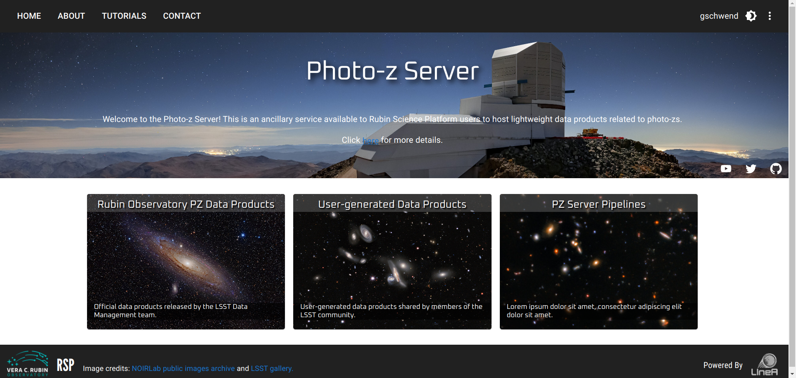

## S4.2 - Photo-z Server 

### Introduction 

 Inspired by features of the DES Science Portal ([Gschwend et al., 2018](https://www.sciencedirect.com/science/article/abs/pii/S2213133718300891?via%3Dihub); [Fausti Neto et al., 2018](https://www.sciencedirect.com/science/article/abs/pii/S2213133717300975)), the Photo-z (PZ) Server is being developed to be an online service, complementary to the Rubin Science Platform (RSP), to host PZ-related lightweight data products and to offer data management tools that allow sharing data products among RSP users, attach and share relevant metadata, and help on provenance tracking. 
 
The PZ Server is hosted at the Brazilian Independent Data Access Center (IDAC) and is open to all RSP users (LSST data rights holders), without geographic constraints. It is designed to be as broad and generic as possible to be helpful to all LSST Science Collaborations working with PZ data products. As required by LSST in-kind program, the source code will be publicly available on [GitHub](https://github.com/linea-it/pzserver_app).

The PZ Server was designed to focus on helping RSP users participate in the PZ Validation Cooperative, a DM team's initiative that will take place during LSST commissioning phase (see technical note dmtn-049 for details). The PZ Coordination Group will receive "admin" user credentials with special permissions to add data products tagged as "official data products". During the PZ Validation Cooperative, the PZ Coordination Group can use the PZ Server to host and distribute standardized training and validation sets to be used in algorithm performance comparison experiments and collect the results of different users. 

Nonetheless, the PZ Server will continue serving the LSST Community in subsequent years. Beyond the PZ Validation Cooperative, the RSP users can use the PZ Server to easily keep track and share lightweight files containing varied test results.

### Photo-z Server Website

The PZ Server will be accessible via the website ([pz-server.linea.org.br](https://pz-server.linea.org.br)), where the users can upload user-generated data products and browse to find and download data products from a list. The official data products are listed on a separate page (the card on the left side of the landing page). 



During the development phase, a test environment is available at [pz-server-dev.linea.org.br](https://pz-server.linea.org.br). Feedback from future PZ Server users is more than welcome. Please [contact us](mailto:julia@linea.org.br) if you are interested in joining the group of testers.    


!!! Note
    All data products uploaded to the PZ Server will automatically be visible and available, without any scientific validation, to all RSP users and only for this particular group. Therefore it is not the appropriate tool to release data products to the general public.   


### PZ Server API 

The PZ Server also offers an API in the form of Python package to facilitate the command-line access of data and metadata. The API contains functions to explore the data products available, retrieve the contents of a given data product to work on memory, or download the files of interest.  

 The Python package **pzserver** is installable via pip as: 

```  pip install pzserver ```

Please go to the [PZ Server Library's documentation page](https://linea-it.github.io/pzserver) for details. 

For new users, a tutorial is available as Jupyter Notebook on the `pzserver` repository. To access the notebook: 

```git clone https://github.com/linea-it/pzserver```

and find it in `docs/notebooks/intro_notebook.ipynb`. 


