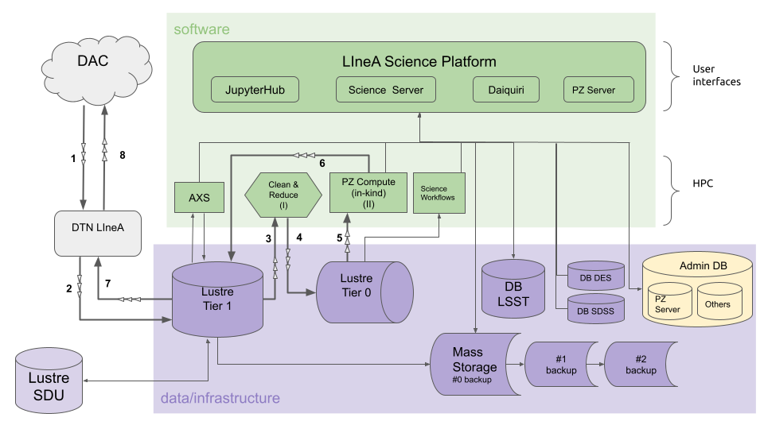

## S4.4 - PZ Tables as Federated Datasets 

### Introduction

During its ten years of operations, the Legacy Survey of Space and Time (LSST) will provide photometric measurements for billions of objects. Most of the foreseen LSST science cases will rely on photometric redshifts (photo-z) estimates for these objects. 

The LSST Project's Data Management (DM) department plans to provide at least one, possibly more, photo-z estimates for each object as part of each data release. Given the large and diverse scope of science that can result from the LSST data, a unique photo-z method is expected to not satisfy all the requirements of the whole community. 

This contribution consists in offering photo-z tables as federated datasets for each data release, using a different photo-z method from the official estimates (to be defined by the DM team), thus expanding the scope of the science supported by the data releases. 

The infrastructure required to produce, store, and deliver the photo-z tables will be provided by the Brazilian IDAC. The software development necessary to produce these tables, which include the optimization and refactoring of the DES photo-z pipelines to run on the LSST scale and the production of new pipelines to cover all steps of the data flow, is accounted for as a directable software development effort. 

### Software development 

The initial plan of software development consisted of refactoring the pipeline Photo-z Compute from the DES Science Portal, to ensure scalability in LSST. The new pipeline would keep only the concepts of data preparation, parallelization, easy access to metadata, and provenance control. The LSST scale imposes the adoption of a completely different techlogoly from that used in the DES Portal.

Preliminary tests using Parsl to handle the parallelization and using the photo-z code [LePHARE](https://www.cfht.hawaii.edu/~arnouts/LEPHARE/lephare.html){:target="_blank"} were carried out in 2021-2022. In mid-2022, the development team started an investigation to evaluate the possibility of reusing [RAIL](https://github.com/LSSTDESC/RAIL){:target="_blank"} (open source code, developed by DESC) infrastructure to support the production of photo-z tables.

The current version of the pipeline PZ Compute (2023) consists of a set of scripts to automatize the preparation of input data and the execution of RAIL estimate module  at LIneA's HPC environment. It supports two photo-z algorithms: BPZ and FlexZBoost. LIneA team will contribute to RAIL development by implementing the wrapper of the photo-z algorithm recommended by DM, if it is not yet implemented at the time.

#### Roadmap for development phase 
 
- Development of scripts to automatize data integrity tests after the data transfer. 
- Development of scripts to automatize the creation of skinny tables (lightweight input tables). 
- Development of Jupyter notebooks to perform PZ training and validation. 
- Development of scripts to automatize the execution of RAIL with parallelization in HPC Cluster
- Development of pipeline PZ Compute's code profiler and process monitoring
- Scalability tests using the IDAC's infrastructure (Apolo computer cluster and the supercomputer Santos Dumont)
- Integration tests - E2E pre-operations using data previews DP0.2, DP1, DP2 
- Wrapping new photo-z codes into RAIL (if necessary). 
- Performance tests - comparing codes (using DP1 and/or DP2). 

 

### Planning for operations

The figure below shows a flowchart representing the data flow within the Brazilian IDAC infrastructure. The numbered arrows refer to the sequence of processes that involves moving data through the IDAC components. The roman numbers refer to processes involving data transformation. 

The steps involved in the production of PZ tables are organized in four stages: 

#### Stage I   - Data acquisition
* Register new data release (DR) on the IDAC data management system (initial metadata). 
* Start data transfer: download LSST Objects Catalog files from LSST Data Access Center (DAC) to LIneA's Data Transfer Node in DMZ. The following steps are done continuously, as new chunks of data arrive. 
* Save Objects Catalog files on Lustre T1.
* Objects Catalog automatic validation of chunks of data - integrity and consistency checks, QA reports, compare key numbers. Append QA info to DR metadata. 
* Apply data cleaning to create a "skinny table", to be used as input for photo-z pipelines (e.g., select columns, truncate extra decimal cases, etc). Save skinny table on Lustre T0. Append skinny table info to DR metadata.
* Download and store ancillary files (e.g., observing conditions maps, SED templates, documents, etc). Append ancillary files info to DR metadata.

#### Stage II  - Photo-z pre-processing 
* Execution of pipeline Training Set Maker (or download whatever training set recommended by the LSST DM team).
* Characterization of the training set - QA report (Jupyter Notebook).
* Register (and upload) training set(s) on the PZ Server.
* Photo-z Validation: execution of RAIL `inform`, `estimation`, and `evaluation` modules. Report with photo-z quality metrics (Jupyter Notebook).
* Obtain report approval from Rubin DM Photo-z Coord. 
* Register (and upload) PZ validation results on the PZ Server.

#### Stage III - Photo-z computing
* Execution of pipeline PZ Compute (based on RAIL estimation module, customized to run in parallel using the IDAC's * infrastructure) on the whole dataset. 
* Validation of PZ Compute results - Report with metadata, priors, configuration parameters, global statistics, N(z) (global and tomographic bins) (Jupyter Notebook). 
* Register (no upload, only metadata) the PZ table on the PZ Server. 

#### Stage IV - Photo-z post-processing 
* Data preparation for upload (compress files, prepare a package with reports and metadata). Move the PZ table to LIneA's Data Transfer Node in DMZ. 
* Deliver PZ tables (data transfer from BR IDAC to US DAC or Cloud). 
* Register on RSP as a federated dataset. Make table stored in USDF available for RSP users. 

